#### 一、项目功能概述：
该项目实现的是一个基于`RestOn`智能睡眠监测器的睡眠监测系统。`RestOn`智能睡眠检测器通过`WiFi`模块向服务器的`2016`端口发送数据格式为`H:89;B:13;S：0`（代表心率`89`次/分钟，呼吸`13`次/分钟，状态为床上有人）的数据，本地服务器通过 `GatewayWorker` 来进行接收，解析数据，并存入数据库，本睡眠监测系统可以达到实时监控的目的。
> `Socket`服务端的端口号可以在`sleep-monitoring\GatewayWorker_sleep\Applications\YourApp\start_gateway.php`当中进行设置。打开`sleep-monitoring\GatewayWorker_sleep\start_for_win.bat`即可开启`socket`服务端的控制面板。
#### 二、项目细节展示：
该项目文件的首页为睡眠监测模块的实时监控页面，如下图所示：

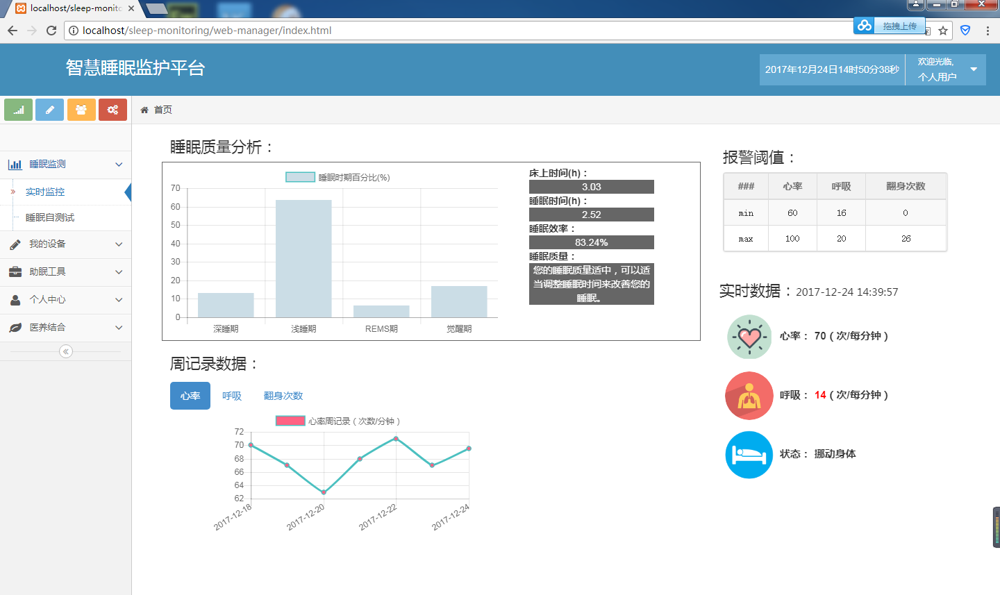

该页面的报警阈值、实时数据、周记录数据均为`1`秒钟向后台数据库进行一次`ajax`请求，当硬件端一直在发送数据时，该页面可以达到实时监控的功能。我们可以在个人中心的设置中心进行报警阈值的设定。该页面在对于请求到的实时数据均会与用户设定的阈值进行比较，若在阈值范围内，字体颜色为黑色，若超出报警阈值，字体颜色则变为红色。

睡眠自测试页面如下图所示：

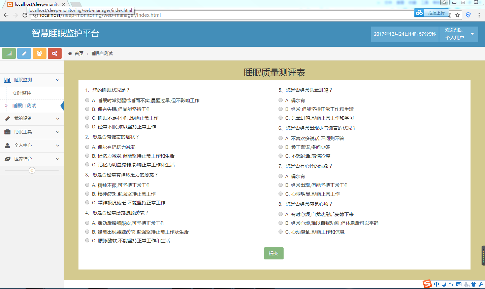

用户可以在该页面进行睡眠自测试，点击提交按钮后，便可以在弹出框当中查看自己的睡眠质量等级。如下图所示：

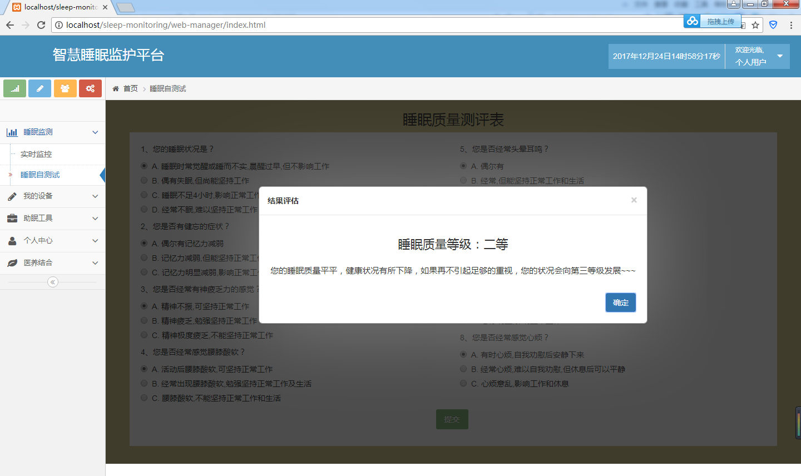

我的设备的舒眠灯控制页面，如下图所示：

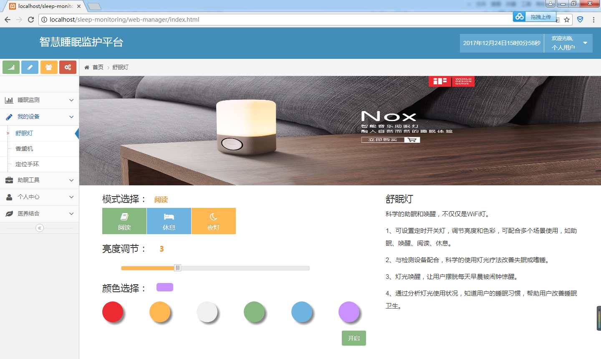

我的设备的香薰灯控制页面，如下图所示：

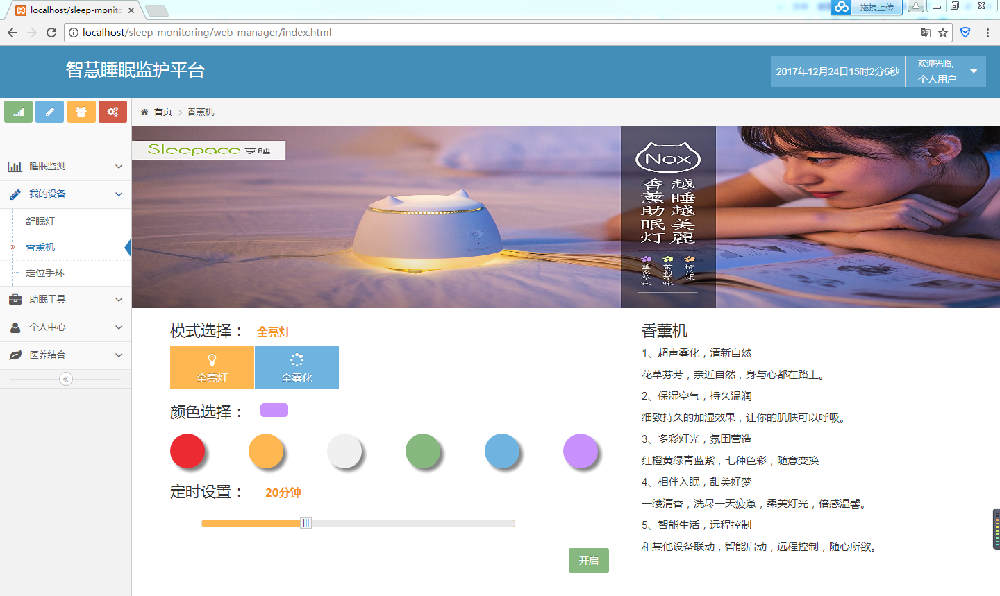

我的设备的定位手环页面，如下图所示：

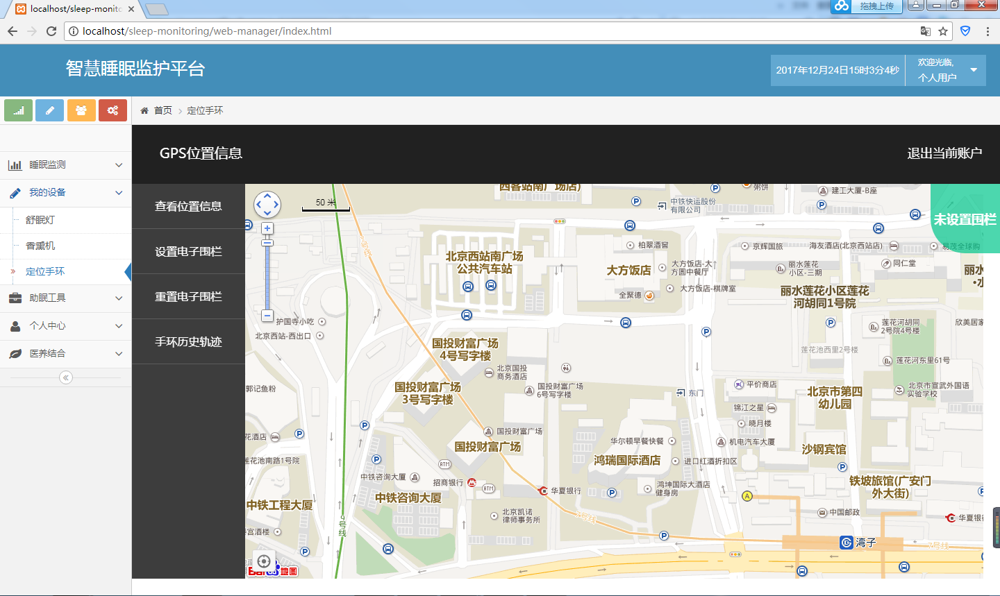

我们可以在该页面点击查看位置信息，可以从数据库当中获取用户当前的经纬度位置信息，并定位至地图的中心点。如下图所示：

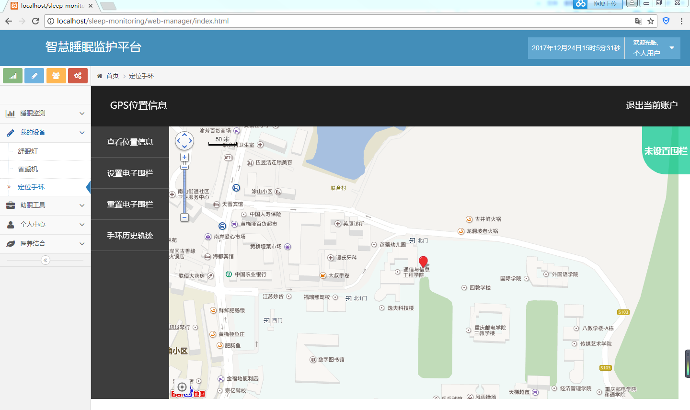

点击设置电子围栏，可以在地图中选择围栏中心点，之后在弹出框内进行围栏半径的设置，如下图所示：

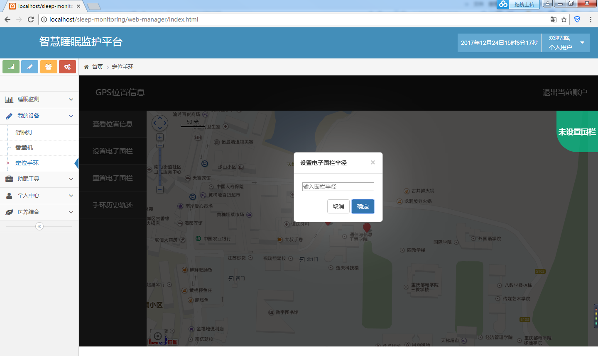

完成电子围栏的设定后，地图右上角会自动进行标识当前用户位置的状态信息。该页面可以进行实时监控的功能，该页面1秒向后台数据库请求一次用户的经纬度信息，并与设定的电子围栏信息进行比较，可以在右上角实时查看用户是否出界。

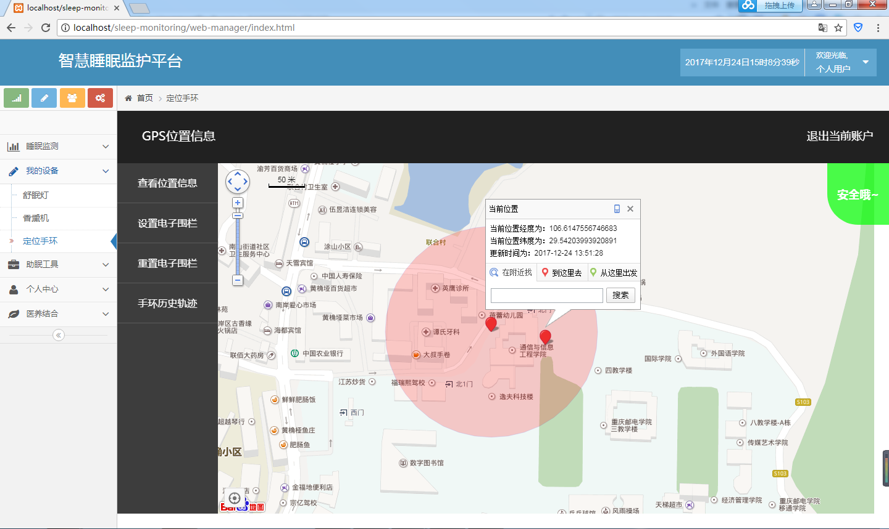

助眠工具的智慧闹钟页面，如下图所示：

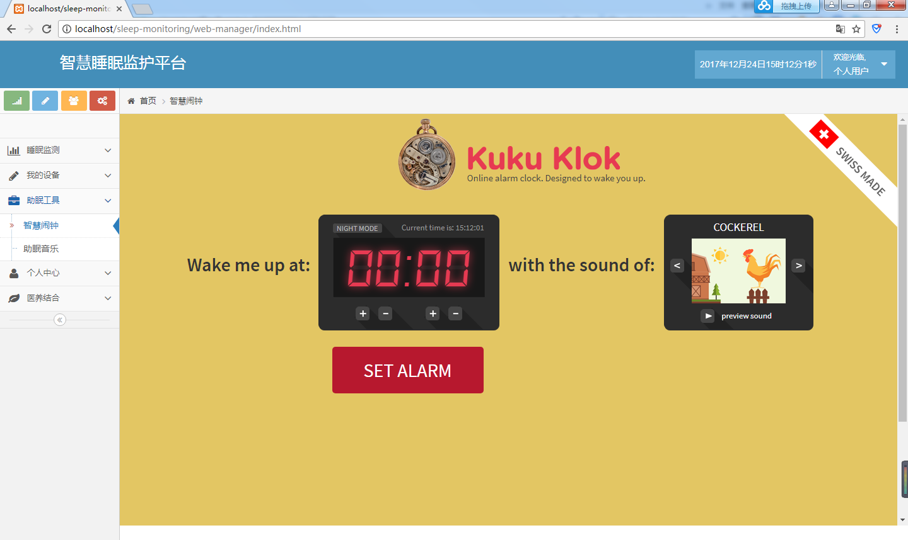

助眠工具的助眠音乐页面，如下图所示：

个人中心的健康档案页面，如下图所示：

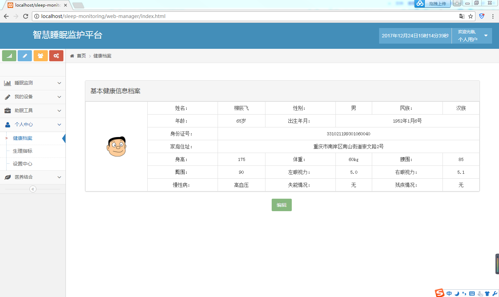

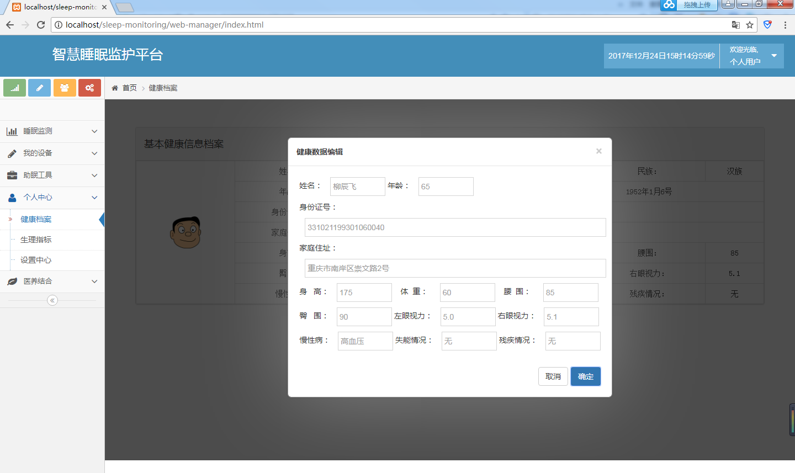

个人中心的生理指标页面，如下图所示：

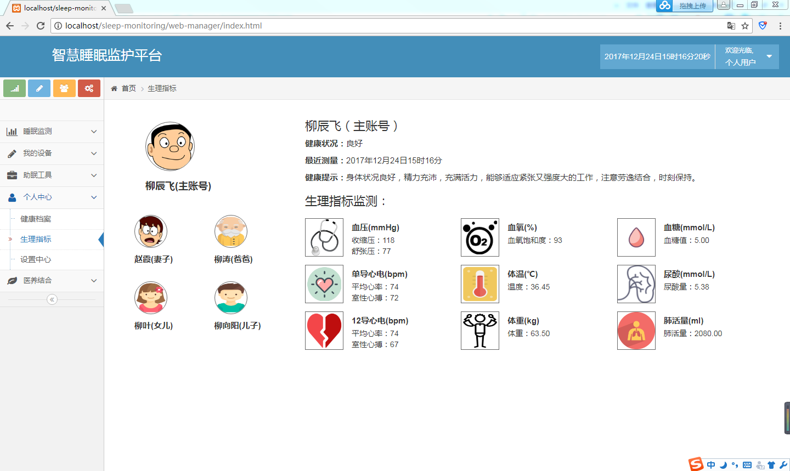

个人中心的设置中心页面，如下图所示：

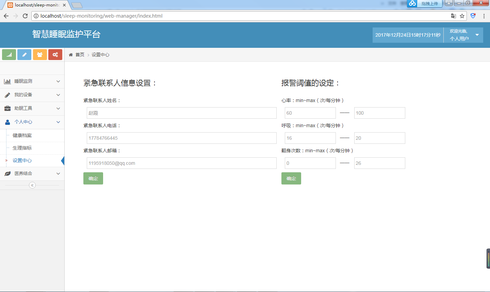

医养结合的预约挂号页面，如下图所示：

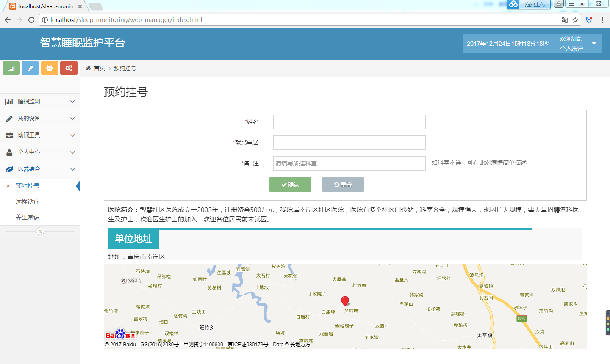

医养结合的远程诊疗页面，如下图所示：

医养结合的养生常识页面，如下图所示：

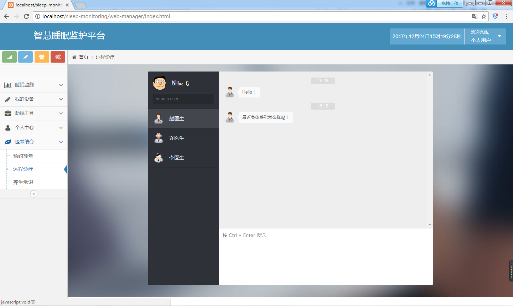
